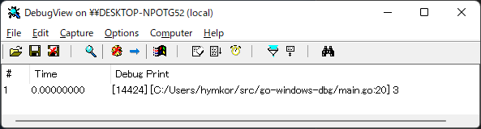

go-windows-dbg
==============

This package contains the functions which output texts to debuggers.

( Renamed and Simplified from [go-outputdebug](https://github.com/zetamatta/go-outputdebug) )

[Example-1](./example.go)
--------------------------------

```example.go
package main

import (
    "github.com/nyaosorg/go-windows-dbg"
)

func main() {
    dbg.Print("output", 1, "text")
    dbg.Printf("output<%d>text", 1)
    dbg.Println("output", 1, "text")

    println("Enabled=", dbg.Enabled)
}
```

```
> start dbgview.exe
> go run example.go
```

Screenshot of [DebugView for Windows](https://technet.microsoft.com/ja-jp/sysinternals/debugview.aspx)


[Example-2](./example2.go)
--------------------------

`dbg.X` is the small function similar with [`dbg!` on Rust](https://doc.rust-lang.org/std/macro.dbg.html).

```example2.go
package main

import (
    "github.com/nyaosorg/go-windows-dbg"
)

func main() {
    println(dbg.X(1 + 2))
}
```

```
> start dbgview.exe
> go run example2.go
3
```



How to Disable output
---------------------

Set the option `-tags=ndebug` when you do `go build` for your package.

You can see the enabled or disabled by referring `dbg.Enabled`.
