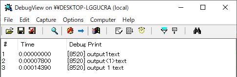

go-windows-dbg
==============

This package contains the functions which output texts to debuggers.

( Renamed and Simplified from [go-outputdebug](https://github.com/zetamatta/go-outputdebug) )

[Example](./example.go)
--------------------------------

```
package main

import (
    "github.com/zetamatta/go-windows-dbg"
)

func main() {
    dbg.Print("output", 1, "text")
    dbg.Printf("output<%d>text", 1)
    dbg.Println("output", 1, "text")
}
```

```
start dbgview.exe
go run example.go
```

Screenshot of [DebugView for Windows](https://technet.microsoft.com/ja-jp/sysinternals/debugview.aspx)


